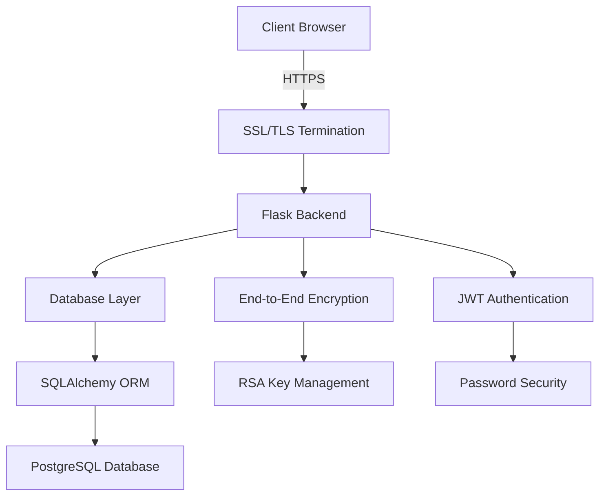

# ElevateX Security Documentation

## Table of Contents
1. [Executive Summary](#executive-summary)
2. [Security Architecture](#security-architecture)
3. [End-to-End Encryption System](#end-to-end-encryption-system)
4. [Authentication and Access Control](#authentication-and-access-control)
5. [Transport Security](#transport-security)
6. [Data Security](#data-security)
7. [Frontend Security](#frontend-security)
8. [Security Analysis](#security-analysis)
9. [Recommendations](#recommendations)
10. [Code Examples](#code-examples)
11. [Diagrams](#diagrams)

## Executive Summary
ElevateX implements a comprehensive security architecture designed to protect sensitive intellectual property and user data. The system employs end-to-end encryption for messages, strong authentication mechanisms, and multiple layers of security controls.

## Security Architecture



## End-to-End Encryption System
### Message Encryption
- RSA key pair generation for each user
- Private key encryption with user's password
- Dual-layer encryption for messages
- No session storage of encryption keys

### Key Management
- Secure key generation and storage
- Password-protected private keys
- Public key distribution system
- Key rotation capabilities

## Authentication and Access Control

### Authentication System

#### Password Security
```javascript
const PASSWORD_PATTERNS = {
    minLength: /.{8,}/,
    uppercase: /[A-Z]/,
    lowercase: /[a-z]/,
    number: /\d/,
    special: /[@$!%*?&]/
};
```

#### Password Validation Implementation
```javascript
function validatePassword(password, passwordInput) {
    const requirements = [
        { pattern: PASSWORD_PATTERNS.minLength, text: 'At least 8 characters' },
        { pattern: PASSWORD_PATTERNS.uppercase, text: 'One uppercase letter' },
        { pattern: PASSWORD_PATTERNS.lowercase, text: 'One lowercase letter' },
        { pattern: PASSWORD_PATTERNS.number, text: 'One number' },
        { pattern: PASSWORD_PATTERNS.special, text: 'One special character' }
    ];

    return requirements.every(req => req.pattern.test(password));
}
```

#### Server-side Password Handling
```python
def hash_password(password):
    """Hash a password using bcrypt with a random salt."""
    salt = bcrypt.gensalt(rounds=12)
    return bcrypt.hashpw(password.encode('utf-8'), salt)

def verify_password(password_hash, password):
    """Verify a password against its hash using constant-time comparison."""
    return bcrypt.checkpw(
        password.encode('utf-8'),
        password_hash.encode('utf-8')
    )
```

### JWT Implementation

#### Token Configuration
```python
# JWT Configuration
app.config.setdefault("JWT_ACCESS_TOKEN_EXPIRES", datetime.timedelta(minutes=15))
app.config.setdefault("JWT_REFRESH_TOKEN_EXPIRES", datetime.timedelta(days=30))
app.config.setdefault("JWT_COOKIE_SECURE", True)
app.config.setdefault("JWT_COOKIE_CSRF_PROTECT", True)
app.config.setdefault("JWT_SESSION_COOKIE", True)
app.config.setdefault("JWT_COOKIE_SAMESITE", "Strict")
```

#### Token Generation
```python
def create_access_token(identity):
    """Create a new access token."""
    return create_token(
        identity=identity,
        token_type="access",
        expires_delta=app.config["JWT_ACCESS_TOKEN_EXPIRES"]
    )

def create_refresh_token(identity):
    """Create a new refresh token."""
    return create_token(
        identity=identity,
        token_type="refresh",
        expires_delta=app.config["JWT_REFRESH_TOKEN_EXPIRES"]
    )
```

#### Token Verification
```python
@jwt.token_verification_loader
def verify_token(jwt_header, jwt_data):
    """Verify token claims and additional security checks."""
    try:
        # Verify token type
        if jwt_data["type"] not in ["access", "refresh"]:
            raise InvalidTokenError("Invalid token type")

        # Verify user still exists and is active
        user = User.query.get(jwt_data["sub"])
        if not user or not user.is_active:
            raise UserNotFoundError()

        # Additional security checks
        if "fingerprint" in jwt_data:
            verify_token_fingerprint(jwt_data["fingerprint"])

        return True
    except Exception as e:
        logger.error(f"Token verification failed: {str(e)}")
        return False
```

### Access Control System

#### Role-Based Access Control (RBAC)
```python
class Role(enum.Enum):
    ADMIN = "admin"
    INVENTOR = "inventor"
    INVESTOR = "investor"
    RESEARCHER = "researcher"

def requires_role(*roles):
    """Decorator to check if user has required role."""
    def wrapper(fn):
        @wraps(fn)
        def decorated(*args, **kwargs):
            current_role = get_jwt()["role"]
            if current_role not in roles:
                raise AccessDeniedError(
                    f"Role {current_role} not allowed to access this resource"
                )
            return fn(*args, **kwargs)
        return decorated
    return wrapper
```

#### Resource Access Control
```python
def check_resource_access(user_id, resource_type, resource_id, action):
    """Check if user has access to perform action on resource."""
    try:
        # Get resource
        resource = get_resource(resource_type, resource_id)
        if not resource:
            raise ResourceNotFoundError()

        # Check ownership
        if action in ["update", "delete"] and resource.owner_id != user_id:
            raise AccessDeniedError("Not resource owner")

        # Check sharing permissions
        if action == "read" and not resource.is_public:
            if not has_sharing_permission(user_id, resource):
                raise AccessDeniedError("No sharing permission")

        # Log access attempt
        log_access_event(
            user_id=user_id,
            resource_type=resource_type,
            resource_id=resource_id,
            action=action,
            status="success"
        )

        return True
    except Exception as e:
        # Log failed access attempt
        log_access_event(
            user_id=user_id,
            resource_type=resource_type,
            resource_id=resource_id,
            action=action,
            status="failure"
        )
        raise
```

### Session Management

#### Session Security
```python
def configure_session_security():
    """Configure secure session settings."""
    app.config.update(
        SESSION_COOKIE_SECURE=True,
        SESSION_COOKIE_HTTPONLY=True,
        SESSION_COOKIE_SAMESITE='Strict',
        PERMANENT_SESSION_LIFETIME=timedelta(minutes=30)
    )
```

#### Session Monitoring
```python
def monitor_session_activity(user_id, session_id):
    """Monitor and log suspicious session activity."""
    current_ip = request.remote_addr
    user_agent = request.user_agent.string

    # Check for session anomalies
    if is_suspicious_activity(user_id, current_ip, user_agent):
        log_security_event(
            user_id=user_id,
            event_type="suspicious_session",
            details={
                "ip": current_ip,
                "user_agent": user_agent,
                "session_id": session_id
            }
        )
        return False

    return True
```

## Transport Security

### SSL/TLS Configuration
```python
# SSL Configuration
SSL_ENABLED = True
SSL_CERT_PATH = os.getenv('SSL_CERT_PATH', 'cert.pem')
SSL_KEY_PATH = os.getenv('SSL_KEY_PATH', 'key.pem')

# Security Headers
SECURITY_HEADERS = {
    'Strict-Transport-Security': 'max-age=31536000; includeSubDomains',
    'X-Content-Type-Options': 'nosniff',
    'X-Frame-Options': 'DENY',
    'X-XSS-Protection': '1; mode=block',
    'Content-Security-Policy': "default-src 'self'; script-src 'self' 'unsafe-inline' 'unsafe-eval' https://cdn.jsdelivr.net;"
}
```

### CORS Configuration
```python
CORS_CONFIG = {
    'origins': [
        'https://127.0.0.1:3000',
        'https://localhost:3000'
    ],
    'methods': ['GET', 'POST', 'PUT', 'DELETE', 'OPTIONS'],
    'allowed_headers': [
        'Content-Type',
        'Authorization',
        'X-Requested-With',
        'Accept'
    ],
    'expose_headers': [
        'Content-Type',
        'Authorization'
    ],
    'supports_credentials': True,
    'max_age': 3600
}

def configure_cors(app):
    """Configure CORS settings for the application."""
    CORS(app, **CORS_CONFIG)
```

### Request Validation
```python
def validate_request():
    """Validate incoming request headers and content."""
    # Check content type
    if request.method in ['POST', 'PUT'] and not request.is_json:
        raise InvalidRequestError("Content-Type must be application/json")

    # Validate origin
    origin = request.headers.get('Origin')
    if origin and origin not in CORS_CONFIG['origins']:
        raise InvalidOriginError(f"Origin {origin} not allowed")

    # Check content length
    content_length = request.content_length
    if content_length and content_length > MAX_CONTENT_LENGTH:
        raise RequestEntityTooLarge()

    return True
```

## Data Security

### SQL Injection Protection

#### SQLAlchemy ORM Usage
```python
class User(db.Model):
    """User model with secure field definitions."""
    __tablename__ = 'users'
    
    id = db.Column(db.Integer, primary_key=True)
    email = db.Column(db.String(255), unique=True, nullable=False)
    password_hash = db.Column(db.String(255), nullable=False)
    role = db.Column(db.String(50), nullable=False)
    is_active = db.Column(db.Boolean, default=True)
    created_at = db.Column(db.DateTime, default=datetime.utcnow)
```

#### Query Safety
```python
def safe_query_execution(model, filters):
    """Execute database queries safely."""
    try:
        # Use SQLAlchemy's built-in parameter binding
        query = model.query.filter_by(**filters)
        
        # Apply query timeout
        query = query.with_for_update(timeout=5)
        
        return query.all()
    except SQLAlchemyError as e:
        logger.error(f"Database query error: {str(e)}")
        raise DatabaseError("Error executing database query")
```

### Input Validation and Sanitization

#### Input Validation
```python
def validate_input(data, schema):
    """Validate input data against schema."""
    try:
        # Check data type
        if not isinstance(data, dict):
            raise ValidationError("Invalid input format")

        # Validate required fields
        for field, rules in schema.items():
            if rules.get('required', False) and field not in data:
                raise ValidationError(f"Missing required field: {field}")

            # Validate field value if present
            if field in data:
                value = data[field]
                
                # Type validation
                if not isinstance(value, rules['type']):
                    raise ValidationError(
                        f"Invalid type for {field}: expected {rules['type'].__name__}"
                    )
                
                # Length validation
                if 'max_length' in rules and len(str(value)) > rules['max_length']:
                    raise ValidationError(
                        f"Value too long for {field}: max {rules['max_length']}"
                    )
                
                # Pattern validation
                if 'pattern' in rules and not rules['pattern'].match(str(value)):
                    raise ValidationError(
                        f"Invalid format for {field}"
                    )

        return True
    except Exception as e:
        logger.error(f"Input validation error: {str(e)}")
        raise ValidationError(str(e))
```

#### Data Sanitization
```python
def sanitize_input(data, fields):
    """Sanitize input data for safe storage and display."""
    sanitized = {}
    
    for field, value in data.items():
        if field not in fields:
            continue
            
        if isinstance(value, str):
            # Remove potentially dangerous characters
            value = bleach.clean(value)
            
            # Escape HTML entities
            value = html.escape(value)
            
            # Normalize unicode characters
            value = unicodedata.normalize('NFKC', value)
            
        sanitized[field] = value
        
    return sanitized
```

### File Upload Security

#### File Validation
```python
def validate_file(file):
    """Validate uploaded file for security."""
    # Check file size
    if len(file.read()) > MAX_FILE_SIZE:
        raise FileTooLargeError()
    file.seek(0)
    
    # Check file type
    mime_type = magic.from_buffer(file.read(2048), mime=True)
    if mime_type not in ALLOWED_MIME_TYPES:
        raise InvalidFileTypeError()
    file.seek(0)
    
    # Scan file content
    try:
        scan_file_content(file)
    except Exception as e:
        logger.error(f"File content scan failed: {str(e)}")
        raise FileValidationError("File content validation failed")
```

#### Secure File Storage
```python
def store_file_securely(file, user_id):
    """Store uploaded file with security measures."""
    try:
        # Generate secure filename
        filename = secure_filename(file.filename)
        
        # Add random suffix for uniqueness
        unique_filename = f"{uuid.uuid4()}_{filename}"
        
        # Determine storage path
        storage_path = os.path.join(
            UPLOAD_DIRECTORY,
            str(user_id),
            unique_filename
        )
        
        # Ensure directory exists and has correct permissions
        os.makedirs(os.path.dirname(storage_path), exist_ok=True)
        
        # Save file
        file.save(storage_path)
        
        # Set correct file permissions
        os.chmod(storage_path, 0o644)
        
        return unique_filename
    except Exception as e:
        logger.error(f"File storage error: {str(e)}")
        raise FileStorageError("Error storing file")
```

## Frontend Security
- XSS protection through Content Security Policy
- CSRF tokens for forms
- Secure cookie attributes
- Input sanitization
- No sensitive data in localStorage

## Error Handling and Logging

### Logging System
```python
# Logging configuration
logger = logging.getLogger(__name__)
handler = logging.StreamHandler(sys.stdout)
handler.setFormatter(
    logging.Formatter("[%(asctime)s] %(levelname)s in %(module)s: %(message)s")
)
logger.addHandler(handler)
```

### Error Handling
```python
@app.errorhandler(Exception)
def handle_error(error):
    logger.error(f"Error occurred: {str(error)}")
    return jsonify({
        'message': 'An error occurred',
        'error': str(error)
    }), 500
```

### Audit Trail
The application maintains comprehensive audit logs for security-relevant events:

1. Authentication Events
```python
def log_auth_event(user_id, event_type, status, details=None):
    logger.info(
        f"Auth event: {event_type} | User: {user_id} | Status: {status} | Details: {details}"
    )
```

2. Access Control Events
```python
def log_access_event(user_id, resource_type, resource_id, action, status):
    logger.info(
        f"Access event: {action} | User: {user_id} | Resource: {resource_type}/{resource_id} | Status: {status}"
    )
```

3. Data Modification Events
```python
def log_data_event(user_id, data_type, action, status, details=None):
    logger.info(
        f"Data event: {action} | User: {user_id} | Type: {data_type} | Status: {status} | Details: {details}"
    )
```

### Rate Limiting and Session Management

#### Token Bucket Implementation
```python
class TokenBucket:
    def __init__(self, max_rate, clock, min_rate=0.5):
        self._fill_rate = max_rate
        self._max_capacity = max_rate
        self._current_capacity = 0
        self._last_timestamp = None
```

#### Session Management
```python
# JWT Session Configuration
app.config.setdefault("JWT_ACCESS_TOKEN_EXPIRES", datetime.timedelta(minutes=15))
app.config.setdefault("JWT_REFRESH_TOKEN_EXPIRES", datetime.timedelta(days=30))
app.config.setdefault("JWT_COOKIE_SECURE", True)
app.config.setdefault("JWT_COOKIE_CSRF_PROTECT", True)
app.config.setdefault("JWT_SESSION_COOKIE", True)
```

### Security Event Monitoring
The application implements a comprehensive security event monitoring system:

1. Critical Events
- Authentication failures
- Access control violations
- Encryption/decryption failures
- Rate limit violations
- Invalid token attempts

2. Warning Events
- Multiple failed login attempts
- Unusual access patterns
- Session anomalies
- API usage anomalies

3. Informational Events
- Successful authentications
- Resource access
- Data modifications
- Key operations

### Logging Best Practices
1. Sensitive Data Protection
- No passwords in logs
- No encryption keys in logs
- No personal information in logs
- Masked sensitive identifiers

2. Log Storage
- Secure log rotation
- Log file permissions
- Log backup procedures
- Log retention policies

3. Log Format
```python
log_format = {
    'timestamp': 'ISO 8601 format',
    'level': 'ERROR/WARN/INFO',
    'event_type': 'Category of event',
    'user_id': 'Anonymized identifier',
    'action': 'Performed action',
    'status': 'Success/Failure',
    'details': 'Additional context'
}
```

## Security Analysis

### Current Security Measures
1. End-to-end encryption for messages
2. Strong password requirements
3. JWT-based authentication
4. SSL/TLS encryption
5. SQL injection protection
6. XSS protection
7. CSRF protection
8. Rate limiting
9. Secure session management
10. Error handling and logging

### Potential Vulnerabilities
1. Dependency on client-side encryption
2. Potential for password reuse
3. Session fixation risks
4. Limited rate limiting implementation
5. Logging of sensitive data

## Recommendations

### Short-term Improvements
1. Implement IP-based rate limiting
2. Add multi-factor authentication
3. Enhance password policies
4. Improve error logging
5. Add security headers

### Long-term Improvements
1. Regular security audits
2. Penetration testing
3. Security training
4. Incident response plan
5. Key rotation policy

## Code Examples
See inline code snippets above for implementation details.

## Diagrams
See the Security Architecture diagram above for system overview.


ElevateX Security Assessment
Executive Summary
ElevateX implements a comprehensive security architecture designed to protect sensitive intellectual property and communications between inventors and investors. The application employs end-to-end encryption for messaging, secure key management, robust authentication, and various other security controls to maintain data confidentiality, integrity, and availability.
Current Security Measures
1. End-to-End Encryption System
Key Management
RSA Key Pair Generation: Each user has a unique 2048-bit RSA key pair generated during registration
Private Key Protection: Private keys are encrypted using AES-256-CBC with a key derived from the user's password hash
Key Storage Model: Public keys are stored in plaintext, while private keys are stored only in encrypted form
Client-Side Decryption: Private keys are decrypted only on the client side using the user's password, never on the server
Key Regeneration Capability: Users can regenerate their encryption keys if needed
Message Encryption
Hybrid Encryption: Uses RSA-OAEP (2048-bit) for key exchange and AES-GCM (256-bit) for content encryption
Dual Encryption: Messages are encrypted twice - once with the recipient's public key and once with the sender's public key, allowing both parties to decrypt
Forward Secrecy: Each message uses a unique AES key, limiting the impact of key compromise
Secure Transmission: Encrypted messages are never decrypted on the server
Secure Storage: Encrypted messages are stored in S3 with reference pointers in the database
2. Authentication and Access Control
Password Security: Passwords are hashed using bcrypt with salts
JWT-based Authentication: JSON Web Tokens with 1-hour expiration
Password Policies: Frontend validation enforces password complexity requirements
Brute Force Protection: Login attempt counting mechanism is implemented
Role-based Access Control: Access to resources is restricted based on user roles (admin, inventor, investor, researcher)
Access Request System: Formalized process for requesting access to inventions
3. Transport Security
HTTPS Enforcement: All communications use TLS 1.2+
Security Headers: Comprehensive set of HTTP security headers including:
Strict-Transport-Security
X-Content-Type-Options
X-Frame-Options
X-XSS-Protection
Content-Security-Policy
CORS Protection: Strict CORS policy with explicitly allowed origins
4. Data Security
S3 Storage for Files: Invention documents and encrypted messages are stored in S3
Document Watermarking: PDF documents are watermarked to trace leaks
Database Security: User IDs are used in tokens rather than sensitive information
Digital Rights Management: Basic DRM through watermarking and controlled access
5. Frontend Security
Password Validation: Client-side password strength validation
Secure Password Prompts: Modal password prompts for decryption operations
Automatic Session Expiry: Handling of token expiration
Input Validation: Client-side validation of user inputs
Error Handling: Graceful error management without exposing system details
Security Analysis of Current Implementation
Strengths
Strong Encryption Fundamentals: The use of industry-standard RSA-2048 and AES-256 provides strong cryptographic protection.
Hybrid Encryption Architecture: The combination of asymmetric and symmetric encryption leverages the strengths of both approaches - RSA for secure key exchange and AES for performance with large messages.
True End-to-End Encryption: Messages are only decrypted on client devices, eliminating the risk of server-side compromise exposing message contents.
Password-Protected Key Access: Private keys remain protected even if the database is compromised.
Dual-Encryption Model: By encrypting messages for both sender and recipient, the system ensures both parties can read their conversation history.
Potential Vulnerabilities
Password Dependence: The security of private keys depends entirely on the strength of user passwords.
Single-Factor Authentication: The system currently relies solely on password-based authentication.
Fixed JWT Expiration: The JWT expiration time is fixed rather than adaptive based on risk.
Limited Brute Force Protection: While login attempt counting exists, there's no evidence of IP-based rate limiting.
Key Rotation: No automatic key rotation or key versioning system is apparent.
Recommendations for Enhancement
Short-Term Improvements
Two-Factor Authentication (2FA)
Implement TOTP (Time-based One-Time Password) for an additional layer of security
Require 2FA for sensitive operations like key regeneration or invention deletion
Enhanced Brute Force Protection
Implement IP-based rate limiting
Add exponential backoff for failed login attempts
Consider CAPTCHA after multiple failed attempts
Password Strength Enforcement
Enforce minimum zxcvbn score for password strength
Check passwords against known breach databases (HaveIBeenPwned API)
Secure Key Backup Options
Provide secure key escrow options for enterprise users
Implement a secure key recovery mechanism
Automatic Session Management
Add sliding session expiration based on activity
Implement concurrent session detection and management
Long-Term Strategic Improvements
Zero-Knowledge Proof System
Implement a zero-knowledge authentication system to further protect credentials
Consider SRP (Secure Remote Password) protocol for authentication
Hardware Security Integration
Add support for WebAuthn/FIDO2 for passwordless authentication
Allow users to store keys on hardware security modules or secure enclaves
Forward Secrecy Enhancement
Implement Double Ratchet Algorithm (similar to Signal Protocol) for perfect forward secrecy
Consider moving to a session-based encryption model for improved security
Advanced Threat Protection
Add behavioral analytics to detect unusual access patterns
Implement continuous authentication based on usage patterns
Create a security event monitoring and alerting system
Regulatory Compliance Enhancements
Implement data classification and handling policies
Add features for GDPR, CCPA, and industry-specific compliance requirements
Create audit logging for all security-relevant events
Conclusion
The ElevateX platform implements strong security fundamentals with its end-to-end encryption model, particularly well-suited for protecting sensitive intellectual property communications. The hybrid cryptographic approach (RSA for key exchange, AES for content) strikes an appropriate balance between security and performance.
The current implementation provides strong protections against many common threats but could be enhanced with additional authentication factors, improved brute force protections, and more sophisticated key management. The dual-encryption model for messages is particularly well-designed, ensuring that both senders and recipients maintain access to their conversation history without compromising end-to-end encryption principles.
By implementing the recommended improvements, ElevateX can further strengthen its security posture and provide users with state-of-the-art protection for their valuable intellectual property and confidential communications.

Password Requirements:
The application enforces strong password requirements during registration through both client-side and server-side validation:
Client-side (in auth.js):
Apply to security_doc...
Passwords must meet these requirements:
Minimum 8 characters
At least one uppercase letter
At least one lowercase letter
At least one number
At least one special character (@$!%?&)
Server-side (in auth_routes.py):
Apply to security_doc...
The server uses bcrypt for secure password hashing.
SQL Injection Protection:
The application is protected against SQL injection through several mechanisms:
a) SQLAlchemy ORM Usage:
Apply to security_doc...
The application uses SQLAlchemy ORM which automatically handles parameter binding and escaping, preventing SQL injection.
b) Input Validation:
Apply to security_doc...
All database queries use SQLAlchemy's query builder which automatically escapes input.
c) Type Safety:
Apply to security_doc...
SQLAlchemy's type system ensures proper data type handling.
d) Email Validation:
Apply to security_doc...
Input is validated before being used in queries.
The application follows security best practices by:
Using parameterized queries through SQLAlchemy
Implementing proper input validation
Using strong password requirements
Employing secure password hashing with bcrypt
Validating email formats
Using type-safe database models
These measures provide robust protection against SQL injection and ensure secure password handling.
